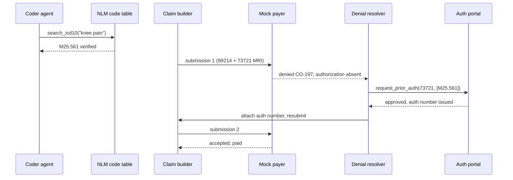

# ClaimLoop: a healthcare claims agent that fights its own denials

An end-to-end teaching demo of the outpatient medical claims lifecycle, run by
LLM agents: a live conversation between a patient and their provider goes in,
and the system writes the visit note, suggests ICD-10-CM and CPT codes,
assembles a claim, submits it to a simulated payer, reads the denial, and
fights back through resubmission or appeal. The framing matters: when this
chain stalls, patients wait on authorizations and providers absorb the labor,
so faster clean claims are patient-facing infrastructure as much as back
office automation.

Built as a graduate high-risk project for an AI in Healthcare course, and as a
working answer to a question I kept hearing from people in healthcare
operations: how much of the claims grind can a modern agent stack actually
carry, and where exactly does it break?

Author: Abdullah Abdel-Khalek.

## Why this exists

Claims processing is one of the most expensive administrative workflows in US
healthcare. Between the visit itself and the money arriving, humans transcribe
what happened, translate it into ICD-10-CM diagnoses and CPT procedure codes,
assemble a claim, and then argue with the payer when it comes back denied.
Published benchmarks show that LLMs asked to produce medical codes from memory
get them wrong most of the time, which is exactly why this pipeline treats
coding as a tool-using, verifiable, recoverable process instead of a single
prompt.

The interesting question is not "can a model emit codes" but "can an
instrumented pipeline recover when the payer says no". ClaimLoop makes that
loop observable and measurable.

## Architecture


Agents are the rounded process boxes; cylinders are the tools they call;
the payer is plain rules code. The same flow appears as
`report/figures/workflow.png` in the report and slide deck.

### How it is built

The flow above says what moves. This says what is built, and where the model
calls actually live:


Two things this makes explicit. Only the agents layer contains model calls,
so the claim builder and payer verdicts are reproducible code, which is what
makes denial recovery attributable to the agent rather than to a stochastic
adjudicator. And tools are granted per agent, not globally: the scribe holds
no tools and so cannot reach outside its transcript, while only the resolver
can request prior authorization. The guarantees are enforced by structured
output types and tool grants, not by prompt wording.

### How a denial gets fought

The most common recovery pattern from the evaluation, as a sequence:



### Implementation notes

- Agents run on the OpenAI Agents SDK over the Responses API, in streamed
  mode when the UI is watching. Orchestration is a plain Python loop in
  `backend/pipeline/orchestrator.py` because the workflow order never
  changes; agents are used only where language understanding is needed.
- Every agent stage is assigned a model through a profile, and the profile is
  an experiment variable:

  | profile | scribe | coder | resolver |
  | --- | --- | --- | --- |
  | budget | gpt-5.6-luna | gpt-5.6-luna | gpt-5.6-luna |
  | balanced | gpt-5.6-luna | gpt-5.6-terra | gpt-5.6-terra |
  | premium | gpt-5.6-terra | gpt-5.6-terra | gpt-5.6-sol |

  At August 2026 prices (Luna $0.20/$1.20, Terra $2/$12, Sol $5/$30 per
  million tokens in/out), a full budget-profile encounter costs well under a
  cent. Cost estimates are computed per run from the constants in
  `backend/pipeline/config.py`.
- The coder must verify every diagnosis code against the free NLM Clinical
  Tables ICD-10-CM API before using it.
- The payer is a rules engine, not an LLM. Same claim in, same verdict out.
  It denies with real public CARC/RARC code numbers (CO-16, CO-50, CO-146,
  CO-150, CO-181, CO-197, CO-18) so the denial loop has something real to
  push against.
- The resolution agent can call a mock prior authorization portal, correct
  codes, downcode visits, write an appeal letter, or give up.

## Quickstart

```
python -m venv .venv
.venv\Scripts\pip install -r requirements.txt
copy .env.example .env        (then put your OpenAI API key in .env)
.venv\Scripts\python scripts\fetch_data.py
cd frontend && npm install && npm run build && cd ..
.venv\Scripts\python -m uvicorn backend.app:app --port 8000
```

Open http://localhost:8000, pick an encounter, and watch the claim journey:
the left side is a live agent console (streaming output, tool calls against
the NLM code table and the payer's auth portal, stage progress), the right
side fills with the artifacts (note, codes, claim JSON, adjudication with
CARC chips, resolver decisions, appeal letters). The "mock playback" button
replays a scripted run through the real claim builder and payer without
spending tokens, useful for previewing the UI.

Run the tests (offline, no API key needed):

```
.venv\Scripts\python -m pytest backend/tests -q
```

Run a single-encounter smoke test, then the evaluation batch:

```
.venv\Scripts\python scripts\smoke.py --profile budget
.venv\Scripts\python scripts\run_eval.py --splits valid,test1 --profile budget --concurrency 4
```

Each profile writes to its own results/<profile>/ directory so tiers can be
compared side by side.

## Data

Encounters come from ACI-Bench (Yim et al., Scientific Data 2023), a public
CC BY 4.0 benchmark of simulated doctor-patient conversations written with
clinician input, distributed through Microsoft's
clinical_visit_note_summarization_corpus repository. `scripts/fetch_data.py`
downloads it at a pinned commit. Per course rules the data itself is never
committed to this repository, and no real patient data is involved anywhere.

Identifiers a claim needs but the dataset does not provide (member IDs, dates
of birth, the provider) are deterministic placeholder stubs derived from the
encounter ID, clearly marked in `backend/pipeline/demographics.py`.

## Results at a glance

From the committed evaluation (60 ACI-Bench encounters end to end on the
budget profile, August 2026):

| metric | value |
| --- | --- |
| first-pass claim acceptance | 50/60 (83.3 percent) |
| final acceptance after the denial loop | 58/60 (96.7 percent) |
| prior-auth denials (CO-197) auto-recovered | 2 of 2 |
| documentation denials (CO-150) recovered | 2 of 2 |
| medical-necessity denials (CO-50) recovered | 6 of 8 (incl. 2 successful appeals) |
| mean cost per encounter | $0.0039 |
| whole study inference cost | $0.23 |

On the 20 encounters both tiers ran, gpt-5.6-luna matched gpt-5.6-terra
exactly (19/20 first pass, 20/20 final) at about a fifth of the cost. The
two unrecovered claims are analyzed in the report: one exposes that the
resolver has no memory across attempts (it oscillated between two diagnosis
pointers until the duplicate rule fired), the other shows it correctly
refusing to invent a diagnosis to force a claim through. Full numbers live
in `results/<profile>/summary.md` and `results/comparison.md`.

## What the evaluation measures

- First-pass acceptance rate and final acceptance rate after the denial loop
- Which CARC denial categories the resolver can and cannot fix
- Appeal outcomes
- Scribe note quality as ROUGE against the ACI-Bench reference notes
- Tokens and wall time per stage and per encounter

What it deliberately does not claim: clinical correctness of code assignment.
Scoring that would require certified coders and payer-grade ground truth,
which this project does not have. The report is explicit about that boundary.

## Why this is not production ready

This is a readable demo, on purpose. Viewed from the AI production side
first, you would need, at minimum:

- A human-in-the-loop review queue: coders approve or correct the agent's
  suggestions, nothing goes out the door autonomously
- Observability beyond per-run JSON files: tracing, log aggregation, alerting
- Regression evals in CI, so a prompt or model change cannot silently drop
  the acceptance rate
- State design for the resolver: memory of the attempt history (the evaluation
  shows its absence directly causes an oscillation failure)
- Cost and rate-limit budgets, idempotent retries, versioned prompts

And from the healthcare domain side:

- Real payer connectivity: X12 837/835/277 transactions through a
  clearinghouse, not a JSON mock
- The licensed AMA CPT code set, payer-specific fee schedules, NCCI edits,
  and real coverage policies instead of a tiny illustrative subset
- Eligibility and benefits checks before the visit, not just adjudication after
- HIPAA controls end to end (this demo needs none because it touches no real
  patient data, which was a deliberate design choice)

## Licensing notes

- Code: MIT
- ACI-Bench data: CC BY 4.0, fetched at setup, never redistributed here
- CPT is copyrighted by the American Medical Association. This repository
  contains only a small set of code numbers with paraphrased plain-language
  descriptions for demonstration. A real system licenses the full set.
- CARC/RARC code lists are maintained by X12; descriptions here are paraphrased.

## Disclaimer

Educational demonstration only. Not medical advice, not billing advice, and
not a compliance tool. The payer rules are illustrative fiction.
