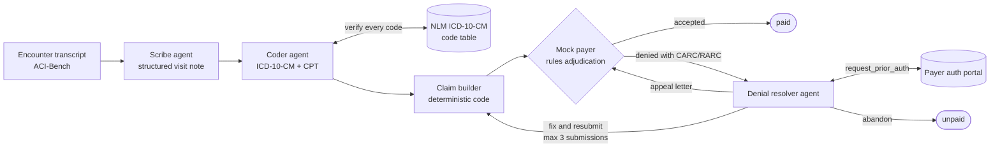
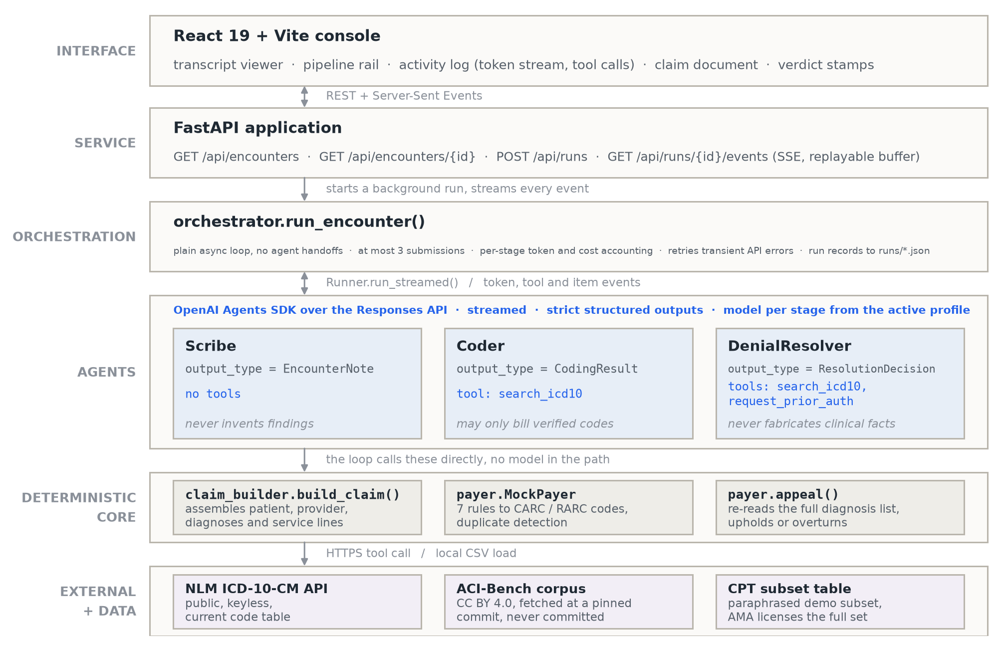
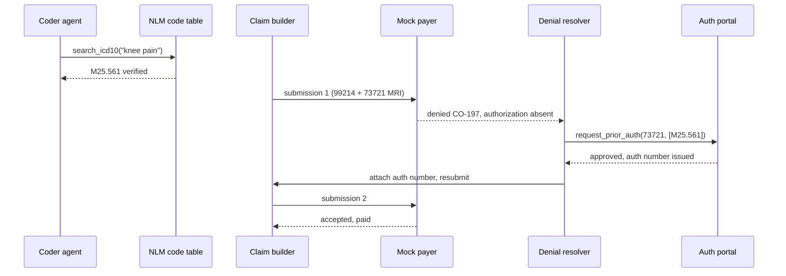

# ClaimLoop: a healthcare claims agent that fights its own denials

An end-to-end teaching demo of the outpatient medical claims lifecycle, run by
LLM agents: a live conversation between a patient and their provider goes in,
and the system writes the visit note, suggests ICD-10-CM and CPT codes,
assembles a claim, submits it to a simulated payer, reads the denial, and
fights back through resubmission or appeal. The framing matters: when this
chain stalls, patients wait on authorizations and providers absorb the labor,
so faster clean claims are patient-facing infrastructure as much as back
office automation.

Built as a graduate high-risk project for an AI in Healthcare course, and as a
working answer to a question I kept hearing from people in healthcare
operations: how much of the claims grind can a modern agent stack actually
carry, and where exactly does it break?

Author: Abdullah Abdel-Khalek.

## Why this exists

Claims processing is one of the most expensive administrative workflows in US
healthcare. Between the visit itself and the money arriving, humans transcribe
what happened, translate it into ICD-10-CM diagnoses and CPT procedure codes,
assemble a claim, and then argue with the payer when it comes back denied.
Published benchmarks show that LLMs asked to produce medical codes from memory
get them wrong most of the time, which is exactly why this pipeline treats
coding as a tool-using, verifiable, recoverable process instead of a single
prompt.

The interesting question is not "can a model emit codes" but "can an
instrumented pipeline recover when the payer says no". ClaimLoop makes that
loop observable and measurable.

## Architecture



Agents are the rounded process boxes; cylinders are the tools they call;
the payer is plain rules code. The same flow appears as
`report/figures/workflow.png` in the report and slide deck.

### How it is built

The flow above says what moves. This says what is built, and where the model
calls actually live:



Two things this makes explicit. Only the agents layer contains model calls,
so the claim builder and payer verdicts are reproducible code, which is what
makes denial recovery attributable to the agent rather than to a stochastic
adjudicator. And tools are granted per agent, not globally: the scribe holds
no tools and so cannot reach outside its transcript, while only the resolver
can request prior authorization. The guarantees are enforced by structured
output types and tool grants, not by prompt wording.

### How a denial gets fought

The most common recovery pattern from the evaluation, as a sequence:



### Implementation notes

- Agents run on the OpenAI Agents SDK over the Responses API, in streamed
  mode when the UI is watching. Orchestration is a plain Python loop in
  `backend/pipeline/orchestrator.py` because the workflow order never
  changes; agents are used only where language understanding is needed.
- Every agent stage is assigned a model through a profile, and the profile is
  an experiment variable:

  | profile | scribe | coder | resolver |
  | --- | --- | --- | --- |
  | budget | gpt-5.6-luna | gpt-5.6-luna | gpt-5.6-luna |
  | balanced | gpt-5.6-luna | gpt-5.6-terra | gpt-5.6-terra |
  | premium | gpt-5.6-terra | gpt-5.6-terra | gpt-5.6-sol |

  At August 2026 prices (Luna $0.20/$1.20, Terra $2/$12, Sol $5/$30 per
  million tokens in/out), a full budget-profile encounter costs well under a
  cent. Cost estimates are computed per run from the constants in
  `backend/pipeline/config.py`.
- The coder must verify every diagnosis code against the free NLM Clinical
  Tables ICD-10-CM API before using it.
- The payer is a rules engine, not an LLM. Same claim in, same verdict out.
  It denies with real public CARC/RARC code numbers (CO-16, CO-50, CO-146,
  CO-150, CO-181, CO-197, CO-18) so the denial loop has something real to
  push against.
- The resolution agent can call a mock prior authorization portal, correct
  codes, downcode visits, write an appeal letter, or give up.

## Where things live

There is no single `main.py`; the project has four entry points, in the order
you would use them:

| Entry point | What it does | Needs an API key |
| --- | --- | --- |
| `scripts/fetch_data.py` | downloads the ACI-Bench corpus into `data/` | no |
| `backend/app.py` | the web app, served with uvicorn | yes |
| `scripts/smoke.py` | one encounter end to end, prints a summary | yes |
| `scripts/run_eval.py` | the full batch evaluation and its figures | yes |

The pipeline itself reads top to bottom in
`backend/pipeline/orchestrator.py`, which is the single best file to start
from if you want to understand the system.

## Try it without an API key

**You can run the full interface, and watch a claim get denied and recovered,
without an OpenAI key, without the dataset, and without spending anything.**
Four commands, about two minutes. Prerequisites are Python 3.11+ and Node 18+.

<details open>
<summary><b>macOS and Linux</b></summary>

```bash
git clone https://github.com/AbdullahAbdelKhalek/claimloop-healthcare-agent.git
cd claimloop-healthcare-agent
python3 -m venv .venv && .venv/bin/pip install -r requirements.txt
(cd frontend && npm install && npm run build)
.venv/bin/python -m uvicorn backend.app:app --port 8000
```
</details>

<details open>
<summary><b>Windows (PowerShell)</b></summary>

```powershell
git clone https://github.com/AbdullahAbdelKhalek/claimloop-healthcare-agent.git
cd claimloop-healthcare-agent
python -m venv .venv; .venv\Scripts\pip install -r requirements.txt
cd frontend; npm install; npm run build; cd ..
.venv\Scripts\python -m uvicorn backend.app:app --port 8000
```
</details>

Open http://localhost:8000 and press **Mock playback**. You will see the real
interface run a real claim: the pipeline stages advancing, agent output
streaming, tool calls to the code lookup and the payer's authorization
portal, an MRI line denied CO-197 for a missing authorization, the resolver
obtaining an authorization number, and the resubmission coming back accepted
and paid. The agent text in this mode is a fixture, but the claim builder and
every payer verdict are the real engine, so the denial and the recovery are
genuine rule outcomes rather than a canned animation.

The offline test suite needs nothing either:

```bash
.venv/bin/python -m pytest backend/tests -q      # 15 tests, all offline
```

## Running it for real

To process actual encounters you need two more things: the dataset, which is
free and public, and an OpenAI API key with access to the gpt-5.6 family.

<details open>
<summary><b>macOS and Linux</b></summary>

```bash
cp .env.example .env                      # then paste your key into .env
.venv/bin/python scripts/fetch_data.py    # downloads the corpus, no account needed
.venv/bin/python -m uvicorn backend.app:app --port 8000
```
</details>

<details open>
<summary><b>Windows (PowerShell)</b></summary>

```powershell
Copy-Item .env.example .env               # then paste your key into .env
.venv\Scripts\python scripts\fetch_data.py
.venv\Scripts\python -m uvicorn backend.app:app --port 8000
```
</details>

Now pick an encounter from the dropdown and press **Run the claim lifecycle**.
The transcript of the visit appears first, then the left side becomes a live
agent console (streaming output, tool calls, stage progress) while the right
side fills with the artifacts: the visit note, the codes with the coder's own
confidence, the claim rendered as a claim document, the payer's verdict with
CARC chips, and any resolver decisions or appeal letters. A single encounter
costs well under a cent on the budget profile.

The health badges at the top right report whether the key and the dataset
were found, so a misconfigured setup is visible immediately rather than
failing mid-run. If you start the server before building the frontend, the
root URL explains how to build it rather than returning a bare 404.

## Reproducing the evaluation

```bash
.venv/bin/python scripts/smoke.py --profile budget
.venv/bin/python scripts/run_eval.py --splits valid,test1 --profile budget --concurrency 4
.venv/bin/python scripts/run_eval.py --splits valid --profile balanced --concurrency 4
.venv/bin/python scripts/compare_profiles.py
```

That is exactly what produced the numbers in this README and the report. The
budget batch is 60 encounters and costs about $0.23; the balanced batch is 20
encounters and costs about $0.43. Each profile writes to its own
`results/<profile>/` directory, so tiers can be compared side by side, and
`scripts/compare_profiles.py` writes `results/comparison.md`.

Useful flags: `--limit N` caps the encounter count for a cheap trial run,
`--resume` reruns only the encounters that failed or are missing, and
`--from-raw` rebuilds the summaries and figures from records already on disk
without spending a single token.

**What reproduces exactly, and what does not.** The deterministic half is
fully reproducible: the dataset is pinned to a commit hash, the payer is a
rules engine with no randomness, patient identifiers are derived
deterministically from the encounter id, and the service date is fixed. Given
the same codes, you will get byte-identical claims and verdicts. The agent
half is not: LLM sampling means your notes and code choices will differ from
mine, so your acceptance rates will land near but not exactly on 83.3 and
96.7 percent. This is a property of the system under study, not a defect in
the harness. Every run writes its full configuration to
`results/<profile>/eval_config.json`, including the exact encounter ids, so
any run can be described precisely even though it cannot be replayed
bit for bit.

## Data

Encounters come from ACI-Bench (Yim et al., Scientific Data 2023), a public
CC BY 4.0 benchmark of simulated doctor-patient conversations written with
clinician input, distributed through Microsoft's
clinical_visit_note_summarization_corpus repository.

**You do not need to find the data yourself, and you do not need an account
or credentials for it.** Run this once after installing dependencies:

```bash
.venv/bin/python scripts/fetch_data.py
```

The script downloads ten CSV files straight from the public GitHub raw
endpoint at a pinned commit hash, creates `data/aci-bench/challenge_data/`
for you, prints the row count of every split so you can confirm the download
matched (train 67, valid 20, test1 40, test2 40, test3 40), and writes
`data/DATA_LICENSE.txt` recording the license and citation. Re-running it is
safe: files already on disk are skipped. If you are ever unsure whether the
data is in place, the app's health badge says "data ready" or tells you to
run the script.

The pinned commit is `293e4549` in `scripts/fetch_data.py`. Pinning matters
for replication: even if the upstream repository changes later, everyone who
runs this gets byte-identical inputs.

Per course rules the data itself is never committed to this repository
(`data/` is gitignored), and no real patient data is involved anywhere.

Identifiers a claim needs but the dataset does not provide (member IDs, dates
of birth, the provider) are deterministic placeholder stubs derived from the
encounter ID, clearly marked in `backend/pipeline/demographics.py`.

## Results at a glance

From the committed evaluation (60 ACI-Bench encounters end to end on the
budget profile, August 2026):

| metric | value |
| --- | --- |
| first-pass claim acceptance | 50/60 (83.3 percent) |
| final acceptance after the denial loop | 58/60 (96.7 percent) |
| prior-auth denials (CO-197) auto-recovered | 2 of 2 |
| documentation denials (CO-150) recovered | 2 of 2 |
| medical-necessity denials (CO-50) recovered | 6 of 8 (incl. 2 successful appeals) |
| mean cost per encounter | $0.0039 |
| whole study inference cost | $0.23 |

On the 20 encounters both tiers ran, gpt-5.6-luna matched gpt-5.6-terra
exactly (19/20 first pass, 20/20 final) at about a fifth of the cost. The
two unrecovered claims are analyzed in the report: one exposes that the
resolver has no memory across attempts (it oscillated between two diagnosis
pointers until the duplicate rule fired), the other shows it correctly
refusing to invent a diagnosis to force a claim through. Full numbers live
in `results/<profile>/summary.md` and `results/comparison.md`.

## What the evaluation measures

- First-pass acceptance rate and final acceptance rate after the denial loop
- Which CARC denial categories the resolver can and cannot fix
- Appeal outcomes
- Scribe note quality as ROUGE against the ACI-Bench reference notes
- Tokens and wall time per stage and per encounter

What it deliberately does not claim: clinical correctness of code assignment.
Scoring that would require certified coders and payer-grade ground truth,
which this project does not have. The report is explicit about that boundary.

## Why this is not production ready

This is a readable demo, on purpose. Viewed from the AI production side
first, you would need, at minimum:

- A human-in-the-loop review queue: coders approve or correct the agent's
  suggestions, nothing goes out the door autonomously
- Observability beyond per-run JSON files: tracing, log aggregation, alerting
- Regression evals in CI, so a prompt or model change cannot silently drop
  the acceptance rate
- State design for the resolver: memory of the attempt history (the evaluation
  shows its absence directly causes an oscillation failure)
- Cost and rate-limit budgets, idempotent retries, versioned prompts

And from the healthcare domain side:

- Real payer connectivity: X12 837/835/277 transactions through a
  clearinghouse, not a JSON mock
- The licensed AMA CPT code set, payer-specific fee schedules, NCCI edits,
  and real coverage policies instead of a tiny illustrative subset
- Eligibility and benefits checks before the visit, not just adjudication after
- HIPAA controls end to end (this demo needs none because it touches no real
  patient data, which was a deliberate design choice)

## Copyright and reuse

Copyright (c) 2026 Abdullah Abdel-Khalek. All rights reserved.

This repository is published so it can be read, reviewed, and discussed. It
carries no open-source license, which under default copyright means no
permission is granted to copy, modify, redistribute, or use this code,
commercially or otherwise. Reading it, and forking it within GitHub as that
platform's terms allow, is fine. If you want to use any of it, ask me first.

Other rights that are not mine to grant:

- ACI-Bench data: CC BY 4.0, fetched at setup, never redistributed here
- CPT is copyrighted by the American Medical Association. This repository
  contains only a small set of code numbers with paraphrased plain-language
  descriptions for demonstration. A real system licenses the full set.
- CARC/RARC code lists are maintained by X12; descriptions here are paraphrased.

## Disclaimer

Educational demonstration only. Not medical advice, not billing advice, and
not a compliance tool. The payer rules are illustrative fiction.
